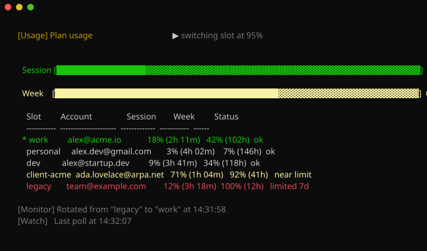
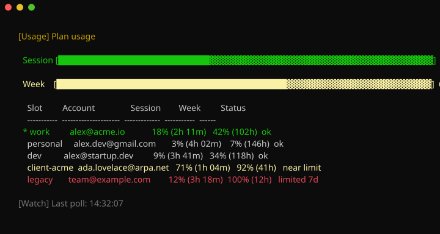
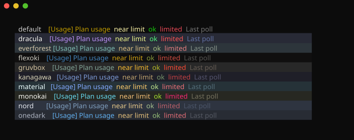

# Switch Claude Account

[](https://github.com/countzero/switch_claude_account/releases/latest) [](https://github.com/countzero/switch_claude_account/commits/main) [](LICENSE) [](https://github.com/PowerShell/PowerShell) [](https://github.com/sponsors/countzero) [](https://ko-fi.com/finnkumkar)

A zero-dependency PowerShell utility for Claude Code on Windows, Linux, and macOS that combines secure multi-account management with a live usage dashboard and automated limit-based rotation.

<p align="center">
  
</p>

## Features

**Account & identity**

- **Identity-aware slots**: each slot's OAuth email is captured at save time, baked into the filename, and locked in a sidecar; what you see in `list` is guaranteed to be who the tokens actually belong to
- **Named slots with rotation**: unlimited accounts under any name (filename-unsafe characters auto-sanitized); `sca switch` with no name cycles through them alphabetically

**Live usage monitoring**

- **Live plan-usage dashboard**: `sca usage -Watch` polls Anthropic's `/api/oauth/usage` and renders a flicker-free, auto-refreshing view of Session (5h) and Week (7d) limits across every slot; the terminal-tab title is updated each poll so a backgrounded watch is glanceable from the taskbar / Alt-Tab
- **Transparent token refresh**: expired access tokens are refreshed before usage queries and mirrored back into the active credentials file

**Automation**

- **Auto-reconcile**: silently captures Claude Code's hourly token refreshes into the tracked slot; auto-saves cross-account swaps under a timestamped name so you never lose state
- **Smart rotation**: `sca monitor` auto-rotates to the next eligible slot when the active one hits a usage threshold (default 95%); works with Claude Code or OpenCode running, no restart needed
- **Cold-slot warmup**: `sca warmup` (and `sca monitor -KeepWarm`) opens each dormant slot's 5h window by running the real Claude Code CLI, so Anthropic reports usage data for every account (billable)

**Reliability & footprint**

- **Atomic-safe writes**: slot-file updates use an atomic rename (`MoveFileEx` on Windows, `rename(2)` on Unix) with retry so they survive a running Claude Code on `.credentials.json`; see [which actions still need it closed](#which-actions-still-need-claude-code-closed)
- **Zero dependencies**: pure PowerShell 7.4+, no external packages, no companion assets

## Installation

### Requisite

**Requires PowerShell 7.4+** on **Windows, Linux, or macOS**. Run everything from `pwsh`.

| Platform | Install PowerShell |
|----------|--------------------|
| Windows  | `winget install Microsoft.PowerShell` |
| Linux    | [Microsoft's package instructions](https://learn.microsoft.com/powershell/scripting/install/installing-powershell-on-linux) |
| macOS    | [Microsoft's package instructions](https://learn.microsoft.com/powershell/scripting/install/installing-powershell-on-macos) |

The test suite runs on all three on every push.

### Download

[Download latest switch_claude_account.ps1](https://github.com/countzero/switch_claude_account/releases/latest/download/switch_claude_account.ps1) and place it anywhere on disk.

> [!TIP]
> Check the [releases page](https://github.com/countzero/switch_claude_account/releases) for older versions.

### Manual (run once)

```powershell
.\switch_claude_account.ps1 install
```

This adds `sca` (short) and `switch-claude-account` (long) aliases to your PowerShell profile. Close and reopen your terminal to activate them.

### Without alias

```powershell
.\switch_claude_account.ps1 <action> [name]
```

## Usage

### Save an account

Log into an account in Claude Code, **close Claude Code**, then save:

```powershell
sca save work
sca save personal
sca save test-project
```

`save` refuses to run while Claude Code is open and refuses to save a slot whose identity it cannot resolve from `~/.claude.json` (primary) or `/api/oauth/profile` (fallback). There are no unlabeled-no-identity slots. To rename a slot: `sca switch old-name; sca save new-name; sca remove old-name`.

### List saved slots

```powershell
sca list
```

The active slot is marked with `*` (sourced from `~/.claude/.sca-state.json`). Slots whose identity sidecar is missing or invalid are hidden from the list, from rotation, and from `switch`; re-running `sca save <name>` while that slot is active recaptures the sidecar.

### Switch to a slot

```powershell
sca switch work
```

`switch` atomically writes the slot's bytes into `.credentials.json` AND restores the slot's captured `oauthAccount` block into `~/.claude.json` so Claude Code's `/status` shows the matching email.

**You can switch while Claude Code is running.** It picks the new account up on its next request, no restart needed. See [Hot-swapping a live session](#hot-swapping-a-live-session).

### Rotate to the next slot

```powershell
sca switch
```

Without a name, `switch` activates the next slot in alphabetical order and wraps from the last back to the first. The current position comes from `state.active_slot`.

### Remove a slot

```powershell
sca remove test-project
```

`remove` refuses to delete the slot tracked as currently active.

### Identity capture: who is each slot actually logged in as?

Slot names are user-assigned labels; nothing stops you from naming a slot `work` and later overwriting it with credentials for a completely different account. At `sca save` time the tool pulls the OAuth email from `~/.claude.json`'s `oauthAccount` block (Claude Code's own cache) and embeds it in the slot filename:

```
~/.claude/.credentials.work(ada.lovelace@arpa.net).json
```

A paired sidecar `.credentials.work(ada.lovelace@arpa.net).account.json` holds the full whitelisted identity (`accountUuid`, `emailAddress`, `organizationUuid`, `displayName`, `organizationName`) so `sca switch` can restore the matching `oauthAccount` block to `~/.claude.json`. Because the email is captured at save time and carried in both the filename and sidecar, it cannot drift from the OAuth tokens; the only way to update a slot's email label is to re-run `sca save`.

When the slot name already equals the OAuth email, the filename is deduplicated to `.credentials.alice@example.com.json` and the `Account` column shows `—`.

### Check plan usage

```powershell
sca usage                         # one-shot table for every slot
sca usage work                    # verbose single-slot block (Session / Week, absolute reset times)
sca usage -Json                   # machine-readable per-slot output
sca usage -NoColor                # strip ANSI color (also: $env:NO_COLOR='1')
```

The output shows the 5-hour session limit (`Session` column, "Current session" in Claude Code's `/usage`) and the 7-day weekly all-models limit (`Week` column, "Current week (all models)") as percentages of each account's Claude.ai subscription:

<p align="center">
  
</p>

Decoding the output:

- **Pool-aggregate bars**: sum utilization over `N × 100%` across every slot with numbers to show, whether read live or served from the cache after a failed read. The `Session` bar reports the capacity you can still reach, so a slot at the 100% `Week` cap leaves it entirely, denominator included: that account serves nothing until its week resets, and its idle `Session` cell describes capacity nobody can spend. The `Week` bar keeps the same slot at its real 100%, because dropping it there would hide the exhaustion. Worth knowing: the `Session` bar therefore improves as slots fall out of the pool, and reads 100% once every slot still in that pool has spent its own session window. A week that has capped every slot reaches the same 100% by a second route: an empty pool is reported as spent rather than left blank. Bar color: green &lt;50%, yellow ≥50%, red ≥90%.
- **Active marker (`*`)**: sourced from `~/.claude/.sca-state.json`; appears at the start of the row and inherits the row's color.
- **`Account` column**: the OAuth email captured at save time. Shows `—` when the email equals the slot name (deduped filename), the actual email otherwise.
- **`Session` / `Week` cells**: `<pct>% <delta>`. The delta is `(2h 11m)` under 24h with minute precision, `(102h)` at 24h+ with integer hours, or `—` when there is no data. A bucket whose window has already rolled also shows `—`: the percentage it carried describes a window the account has left, so it is dropped rather than shown as stale.
- **`Status` column**: one of `ok`, `near limit` (≥90%), `limited 5h` / `limited 7d` (≥100%), `error` (`error <code>` on an HTTP failure that carried one), `expired`, `unauthorized`, `rate-limited`, or `no-oauth`. Status drives the entire row's color.
- **Failure reasons**: labels stay short so they cannot widen the table. Why a slot failed prints below it as `[Usage] <slot>: <reason>`. The block is capped at eight lines so it cannot push the table off screen in a live watch; the lines naming every affected slot and the per-status remedies (`expired`, `unauthorized`, `no-oauth`) are kept first, and up to three per-slot messages take whatever is left. No failed slot is left unexplained.

Drill into a single slot for absolute reset times in your local timezone:

```powershell
sca usage work
```

<p align="center">
  
</p>

`list`, `switch`, `usage`, `warmup`, and `monitor` (per poll) run a quiet **reconcile** pass before doing their work: if `.credentials.json` has changed since the last sync (Claude Code refreshed a token, or you logged into a different account inside Claude Code), the new bytes are captured into the tracked slot, or auto-saved under `auto-<UTC-timestamp>(<email>).json` if the email differs.

> [!WARNING]
> **Unofficial API.** `sca usage` calls `api.anthropic.com/api/oauth/usage`, the same endpoint Claude Code's `/usage` uses internally. Undocumented by Anthropic and may break on Claude Code upgrades; when that happens, see the extraction recipe at the top of `switch_claude_account.ps1` to re-pin the constants. The endpoint is not a public API and may be changed or withdrawn at Anthropic's discretion; use accordingly.

> [!NOTE]
> **Token refresh.** If a slot's access token has expired (default TTL ~1h), `sca usage` transparently refreshes it against `platform.claude.com/v1/oauth/token` and mirrors the new tokens back into both the slot file and `.credentials.json` via atomic rename so the active session keeps working.

### Watch plan usage live

Execute `sca usage -Watch` to enable the live dashboard:

```powershell
sca usage -Watch                  # live, self-refreshing view; Ctrl-C to quit
sca usage work -Watch             # follow a single slot
sca usage -Watch -Interval 300    # slower poll cadence (60s floor)
sca usage -Watch -NoColor         # strip ANSI color
```

The terminal-tab title is updated on every poll so a backgrounded watch is glanceable from the taskbar / Alt-Tab:

    18% | 42% | Switch Claude Account

<p align="center">
  
</p>

> [!NOTE]
> The title's numbers come from the **active** slot (or the slot named in `sca usage <name> -Watch`); a non-`ok` row falls back to the bare brand suffix. A `[~]` prefix appears when a bucket is ≥90%, `[!]` when ≥100%. Pre-watch title is restored on Ctrl-C.

### Warm up cold slots

Anthropic only reports `/api/oauth/usage` data for slots that have an open server-side 5h session window, which only a real message can open. Warmup automates the manual "switch to a slot, send one message" routine across every saved slot: for each slot it switches in and runs the real Claude Code CLI (`claude -p "Hi"` in safe-mode on Haiku, ~$0.004/slot), then restores the slot you started on. Because it runs the actual client, it opens the window exactly like you typing a message would.

```powershell
sca warmup                            # warm every slot once, print the table, exit
sca warmup slot-2                     # warm just one slot
sca monitor -KeepWarm                 # auto-rotate AND keep every slot warm for the whole watch
```

`sca monitor -KeepWarm` does more than the one-shot pass: at each poll it re-opens any slot whose 5h window has since closed, so a long session keeps every slot warm instead of letting them all expire ~5h after startup. (A 5h window can only be reopened *after* it closes, so a just-expired slot is re-warmed within one poll, not before.) A per-slot cooldown keeps a slot whose warm keeps failing from being retried every poll.

Both `sca warmup` and `sca monitor -KeepWarm` run with Claude Code open, and `sca warmup` says so when it finds it: the pass makes *every* slot active in turn, so a live session follows it across each account before landing back where it started, and a prompt sent meanwhile bills whichever slot is mounted ([details](#which-actions-still-need-claude-code-closed)). Both also require the `claude` CLI to be installed and logged in. A slot whose token refresh is temporarily rate-limited is reported and skipped, not retried. `-KeepWarm` is the typical companion to `monitor`: rotation needs every peer slot reporting real data to make good decisions, which keeping them warm guarantees.

### Auto-rotate on usage limit

`sca monitor` is a live watch that auto-rotates to the next eligible slot when the active slot's `max(Session, Week)` utilization hits the threshold. Rotation is what `monitor` is for, so it is always on; for a live view that does not rotate use `sca usage -Watch` instead.

```powershell
sca monitor                  # rotate when active slot hits 95% (default)
sca monitor -Threshold 90    # rotate earlier on either bucket
sca monitor -KeepWarm        # also keep every slot warm (billable)
```

Peer slots are walked in alphabetical wrap order (same direction as `sca switch` without a name); peers that are themselves at or above the threshold are skipped, as are peers with non-`ok` HTTP status. When no peer is eligible, the footer surfaces the soonest reset across all slots as a cooldown ETA: `[Monitor] No free slot available! Cooling down for 1h 12m.`. The mode is indicated on every frame by a right-aligned `▶ switching slot at N%` header indicator plus a latched `[Monitor] …` footer line.

<p align="center">
  
</p>

> [!NOTE]
> **Works with a live client, either one.** Rotation lands in `.credentials.json` and `~/.claude.json`, and both clients follow it without a restart: Claude Code from 2.1.274 on, and OpenCode via [`opencode-claude-auth`](https://github.com/griffinmartin/opencode-claude-auth) **>= 1.5.4**. Leave the app open while `sca monitor` runs, with or without `-KeepWarm`; see [which actions](#which-actions-still-need-claude-code-closed) for the only one that still needs it closed.

### Install / uninstall alias

```powershell
sca install      # Add aliases to your PowerShell profile
sca uninstall    # Remove aliases from your PowerShell profile
sca help         # Show usage info
```

## Workflow

### Saving accounts

1. Open Claude Code and log in with your first account
2. **Close Claude Code**
3. Run `sca save work`
4. Open Claude Code, log out, log in with a different account
5. **Close Claude Code**
6. Run `sca save personal`

`save` refuses while Claude Code is running. It exits immediately with a clear message if you forget; no partial writes occur. See [Which actions still need Claude Code closed](#which-actions-still-need-claude-code-closed) for the full list.

### Switching between accounts

1. Run `sca switch work`
2. That is it. Claude Code can stay open, and `/status` shows the matching email.

### Hot-swapping a live session

`sca switch` and `sca monitor` work with Claude Code running. No restart, no reopening.

Claude Code 2.1.274 follows both files on its own: it polls `~/.claude.json` once a second and picks up external edits, and it re-`stat`s `.credentials.json` at the top of every token-refresh check, dropping its cached credentials when the file moved. Verified against 2.1.274 by handing a running session a different account's credentials mid-request; it re-read them and hit the *new* account's rate limit four seconds later.

That makes Claude Code equivalent to [`opencode-claude-auth`](https://github.com/griffinmartin/opencode-claude-auth) **>= 1.5.4** for this purpose, so `sca monitor` is no longer OpenCode-scoped.

One residual difference from closing the app: `sca` does not take Claude Code's `~/.claude.json.lock`. It re-reads that file immediately before writing and starts over, then gives up, rather than overwrite a change that landed while it was working. That narrows the window to the write itself without closing it. What is at stake there is configuration and per-project prompt history, never a credential.

Credentials get a stronger guarantee, because losing one is not recoverable. Before overwriting a saved slot, `sca` checks that the active tokens really are that slot's account: byte-identical tokens are recognized as a slot that is already saved, accounts are matched on their uuid rather than their email (Claude Code records the same account under either of two email forms), and anything still in doubt is confirmed against `/api/oauth/profile` using those very tokens rather than against the email cached in `~/.claude.json`, which a `/login` updates a moment later than the tokens themselves.

If none of that can attribute the active tokens, `sca` writes nothing rather than guess, and any command that was about to overwrite them stops and says so:

```console
$ sca switch personal
The active credentials could not be attributed to an account, so nothing captured them.
'sca switch' overwrites them, so the token refresh they carry would be lost and slot
'work' left holding a refresh token the server has already rotated. Re-run once an
account can be resolved; if it stays unresolved while you are online, close Claude
Code and run 'sca save work' to capture them by hand.
```

### Which actions still need Claude Code closed

| Action | While Claude Code runs | Why |
|---|---|---|
| `switch`, `usage`, `list`, `remove` | fine | `switch` writes one destination and Claude Code follows it |
| `monitor` | fine | rotation is one destination at a time, same as `switch` |
| `save` | **refuses** | it pairs tokens from `.credentials.json` with an identity from `~/.claude.json`, and a `/login` updates those two separately. Catching that window writes a sidecar naming the wrong account, and nothing later corrects it |
| `warmup`, `monitor -KeepWarm` | fine, with a warning | both make *every* slot active in turn and a live session follows, so a prompt sent mid-pass bills whichever slot is mounted. No login is at risk: Claude Code serializes token refreshes across its own processes and adopts a peer's result rather than racing it, so the `claude -p` a warm pass spawns cannot rotate the token out from under your session |

Slot-file updates done by `sca usage`'s token refresh use `MoveFileEx` with retry, so those survive an open Claude Code on `.credentials.json` itself.

> [!IMPORTANT]
> **The guard does not catch every install shape.** Claude Code installed from npm (`@anthropic-ai/claude-code`) runs as a `node` process rather than one named `claude`, so `sca` has to recognize it from the process command line instead. That works on Linux. It does **not** work on Windows, where reading command lines costs ~53 s and a guard on every write cannot spend that, nor on macOS, where PowerShell does not expose process command lines at all. On those two platforms, close Claude Code yourself before `sca save` rather than relying on the refusal. Claude Code from the native installer is detected on all three.

## Platform Notes

### File locations and `CLAUDE_CONFIG_DIR`
Credentials, slot files, and the state file live in `~/.claude/` (`%USERPROFILE%\.claude\` on Windows), except that Claude Code's own config is `~/.claude.json`, a sibling of that directory rather than a file inside it.

Setting `CLAUDE_CONFIG_DIR` moves the whole tree, including `.claude.json`, and `sca` follows it. A leading `~` is **not** expanded, matching what Claude Code itself does; a relative value resolves against the directory you run the command in, and is resolved once at startup so every read and write in that run lands in the same place. If the relocation leaves saved slots behind in the default directory, `sca` prints one line naming the directory in use and counting what is being skipped; with nothing stranded it stays silent, because the variable is a permanent setting and a line on every invocation would only teach you to ignore it.

The home directory itself comes from `%USERPROFILE%` / `$HOME` when set, and otherwise from the account database, the same fallback Claude Code uses. `sca` works in a container or systemd unit started without those variables.

### File permissions (Linux and macOS)
Every file `sca` writes is created `0600` before being moved into place, matching what Claude Code does. This includes `.credentials.json`, slot files, identity sidecars, the state file, and `~/.claude.json`.

Credential files left readable by anything else are tightened to `0600` on the first run of any action, and `sca` reports how many it changed. That pass covers the files `sca` creates under the credentials directory; `~/.claude.json` is Claude Code's and is left alone, as are symlinks.

A credentials directory `sca` creates for you is `0700`, since slot filenames carry account email addresses. **One that already exists keeps the mode it has**, and on any machine where Claude Code ran before `sca` did, that is the usual case. `sca` will not re-permission another tool's directory, so if the filenames matter to you, run it yourself once:

```bash
chmod 700 ~/.claude
```

### Name sanitization
Spaces, filename-unsafe characters (`\ / : * ? " < > |` and control chars), PowerShell wildcard brackets (`[` `]`), and parentheses (`(` `)`) are automatically replaced with `_`. Trailing dots are stripped. Reserved Windows device names (`CON`, `PRN`, `AUX`, `NUL`, `COM1`-`COM9`, `LPT1`-`LPT9`) are rejected.

These rules are Windows-strict on every platform by design, so a slot name yields the same filename everywhere and a `~/.claude` directory copied from Linux or macOS to Windows stays usable.

- `my personal` → `my_personal`
- `foo/bar` → `foo_bar`
- `foo[bar]` → `foo_bar_`
- `foo(bar)` → `foo_bar_`
- `foo.` → `foo`
- `CON` → error (reserved device name)

### Theming
By default `sca` colors its output with the standard ANSI colors, which means your terminal decides what they actually look like: the output already matches whatever color scheme you have set, on a light background as well as a dark one.

If you would rather pin an exact palette, set `SCA_THEME` to one of `claude`, `dracula`, `everforest`, `flexoki`, `gruvbox`, `kanagawa`, `material`, `monokai`, `nord` or `onedark`:

```powershell
$env:SCA_THEME = 'material'      # PowerShell; add to $PROFILE to make it stick
```

```bash
export SCA_THEME=material        # bash / zsh
```

<p align="center">
  
</p>

Every panel is the whole `sca monitor` view in that theme, so what you see is what you get. Nine of them are the [base16](https://github.com/tinted-theming/schemes) scheme of the same name, so a palette you know from your editor reads the same here; `claude` is an original one keyed to the interface this tool manages logins for. **[docs/themes.md](docs/themes.md)** has the exact hex values and why the `default` panel is the one the picture cannot show honestly.

To turn color off entirely, use `-NoColor` or the standard [`NO_COLOR`](https://no-color.org) variable. Both outrank `SCA_THEME`, since a theme says *which* colors to use, not *whether* to use any:

```bash
export NO_COLOR=1
```

### Profile encoding
`sca install` and `sca uninstall` preserve your PowerShell profile's existing encoding (UTF-8 with or without BOM, UTF-16 LE/BE). ANSI-encoded profiles are treated as UTF-8 no-BOM (indistinguishable without a BOM).

### State file
The active-slot tracker lives at `~/.claude/.sca-state.json`; plain JSON, safe to inspect. Schema: `{ schema, active_slot, last_sync_hash }`.

### Execution policy (Windows)
If you get a security warning on first run, press `Y` or run once as:

```powershell
Set-ExecutionPolicy -Scope CurrentUser RemoteSigned
```

## Testing

```powershell
pwsh -NoProfile -File tests/Invoke-Tests.ps1
```

Pester 5 is auto-installed to `CurrentUser` scope on first use. PSScriptAnalyzer runs in advisory mode if installed. Each test sandboxes `$env:USERPROFILE`, `$env:HOME`, `$env:CLAUDE_CONFIG_DIR` and `$PROFILE.CurrentUserAllHosts` to Pester's `$TestDrive` so your real `.claude` directory and PowerShell profile are never touched. Exit code follows Pester: `0` on pass, non-zero on any failure.

## License & Disclaimer

[MIT](LICENSE). Copyright (c) 2026 Finn Kumkar.

> **Unofficial tool.** Not affiliated with, endorsed by, or sponsored by Anthropic. "Claude" and "Claude Code" are trademarks of Anthropic PBC, used here descriptively. The script interacts with Anthropic's `~/.claude.json` config and the undocumented `/api/oauth/usage` endpoint as a third-party tool; usage is subject to Anthropic's [Consumer Terms of Service](https://www.anthropic.com/legal/consumer-terms) and [Usage Policy](https://www.anthropic.com/legal/aup) in addition to this repo's MIT terms. Use only with Anthropic accounts you personally own; this tool does not enable sharing one account among multiple people.

## Support

If `sca` saves you a hassle, consider supporting future work:

- [GitHub Sponsors](https://github.com/sponsors/countzero): recurring or one-time.
- [Ko-fi](https://ko-fi.com/finnkumkar): one-time tip, no signup required.

<a href="https://ko-fi.com/finnkumkar"></a>
