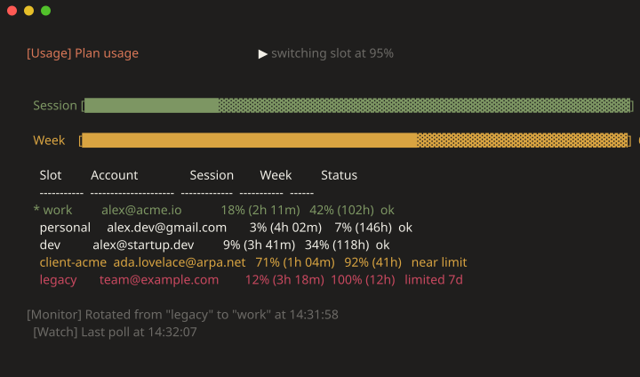
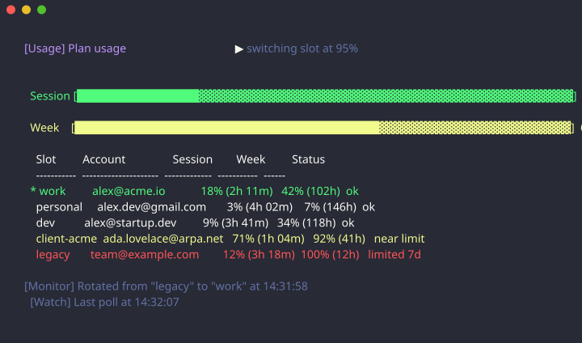
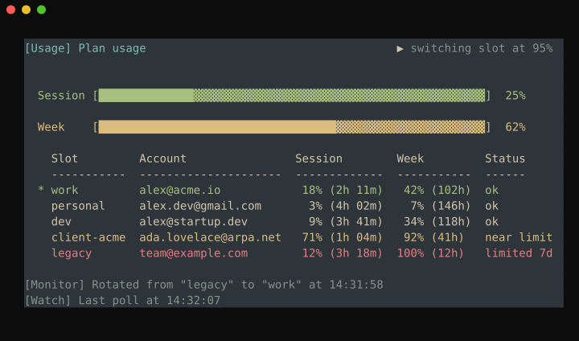
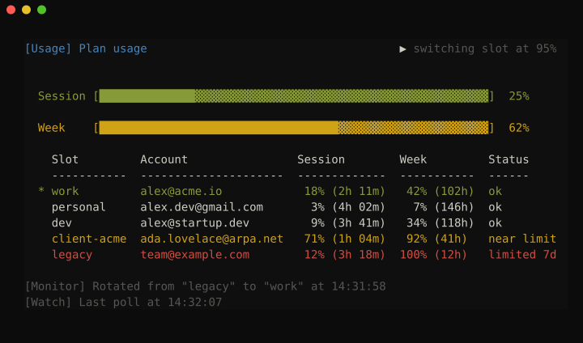
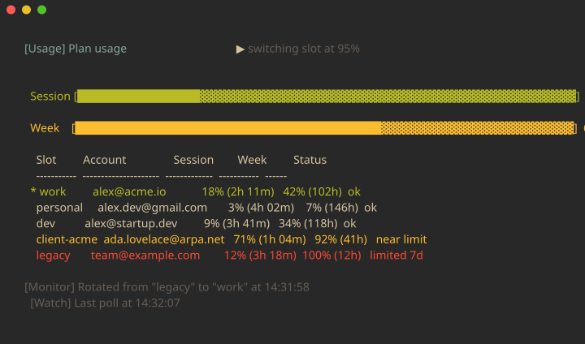
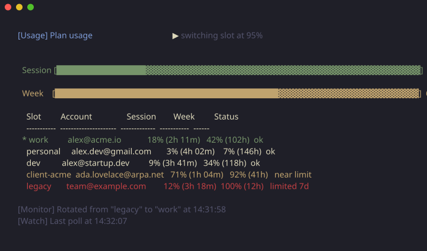
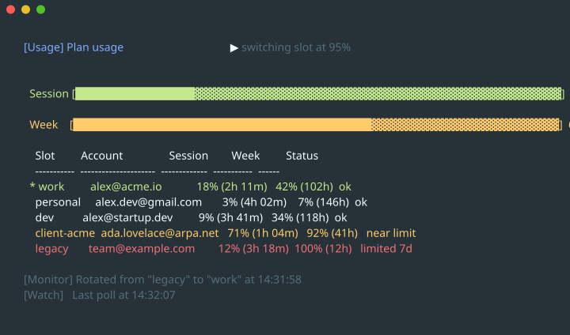
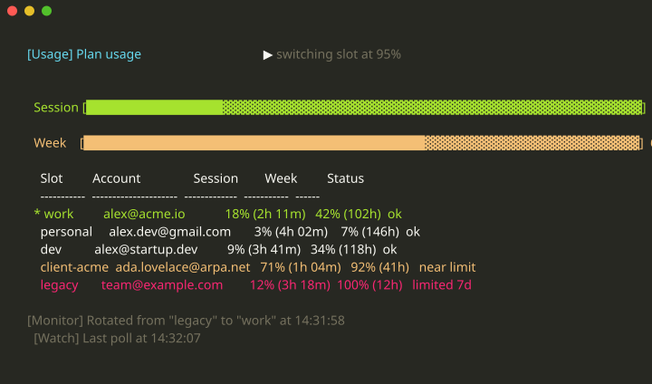
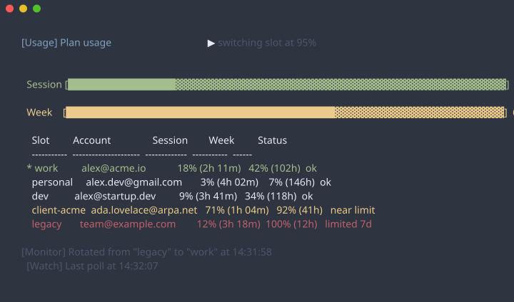
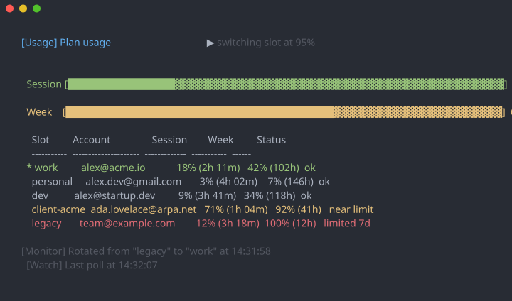

# Themes

Every panel below is the whole `sca monitor` view rendered in that theme, so what you see is what you get. Each has its own heading to link to: [`#claude`](#claude), [`#nord`](#nord), and so on.

```powershell
$env:SCA_THEME = 'nord'          # PowerShell; add to $PROFILE to make it stick
```

```bash
export SCA_THEME=nord            # bash / zsh; add to ~/.bashrc or ~/.zshrc
```

The name is case-insensitive. An unrecognized one falls back to `default` without complaint, since a typo in a shell profile would otherwise print a warning on every command you run; add `-Verbose` to any action to see the miss and the valid names. `sca help` lists them too.

**`default` is the one panel that cannot be honest.** It carries no colors of its own: it emits the standard ANSI codes and lets your terminal decide what they look like, so it already matches whatever scheme you have configured, on a light background as readily as a dark one. Its panel has to pick one interpretation to draw, and picks Windows Terminal's Campbell. If you like how your terminal already looks, `default` is the right answer and no image can show you that.

The other ten are absolute 24-bit color and render exactly as pictured. Nine are the [base16](https://github.com/tinted-theming/schemes) scheme of the same name, dark variant, so a palette you know from your editor reads the same here. `claude` has no upstream: it is an original palette keyed to the warm accent and near-black of the Claude Code interface this tool manages logins for.

---

## default


## claude



## dracula



## everforest



## flexoki



## gruvbox



## kanagawa



## material



## monokai



## nord



## onedark



---

## How a theme is built

Seven values per theme, by one fixed rule: `Heading` `base0D`, `Warning` `base0A`, `Success` `base0B`, `Danger` `base08`, `Muted` `base03`, `Background` `base00`, and `base05` for body text. The values themselves live in `$Script:Base16Schemes` in `switch_claude_account.ps1`.

`Muted` takes `base03` ("Comments") rather than `base04` ("status bars"), even though a status bar is what it renders: `base04` sits close enough to `base05` that the row stops reading as de-emphasized, and being dimmer than the body text is the whole job.

Two constraints hold across every theme and the test suite enforces both. `Danger` must read as red and `Success` as green, because a status table is scanned rather than read: a theme that put orange where red belongs would make a limited slot look merely busy. That rule is why `github` is absent despite having a perfectly good base16 port, its slots carrying orange and pale blue. `claude` meets it by a deliberate margin, its `Danger` pulled to hue 349 so it cannot blur against an accent at hue 15.

## What a theme does and does not touch

**The background only appears in the full-screen views**, `sca usage -Watch` and `sca monitor`. Those own the whole alternate screen and hand it back untouched on exit. Every other command prints into your scrollback, where a background would leave ragged colored bars in your shell history for good, so none is painted there.

**Layout never changes.** Every column lines up identically whichever theme is active.

**A theme needs 24-bit color**, which Windows Terminal, iTerm2, kitty, Alacritty, WezTerm and recent GNOME Terminal all have. Setting the variable is taken as your word that yours does; `sca` does not probe, because the usual probe (`COLORTERM`) is unset on Windows even where truecolor works perfectly.

## Turning color off

`-NoColor` or the standard [`NO_COLOR`](https://no-color.org) variable. Both outrank `SCA_THEME`, because naming a theme says *which* colors to use, not *whether* to use any.

```bash
export NO_COLOR=1
```

## Theming everything at once instead

If you would rather not theme each tool separately, set your terminal's own 16-color palette: Windows Terminal's *Color schemes*, or [`concfg`](https://github.com/lukesampson/concfg) for CMD and the legacy console. `default` uses the standard ANSI colors precisely so it inherits that work, and then `SCA_THEME` is something you never need to set.

## Regenerating these images

`pwsh -NoProfile -File tools/Render-ReadmeImages.ps1` re-renders every SVG in `docs/images/`, these included. The panels are generated from the script's own scheme table and share their scene with `monitor.svg`, so adding a theme and re-running produces its image automatically; only the heading and alt text on this page are maintained by hand.
